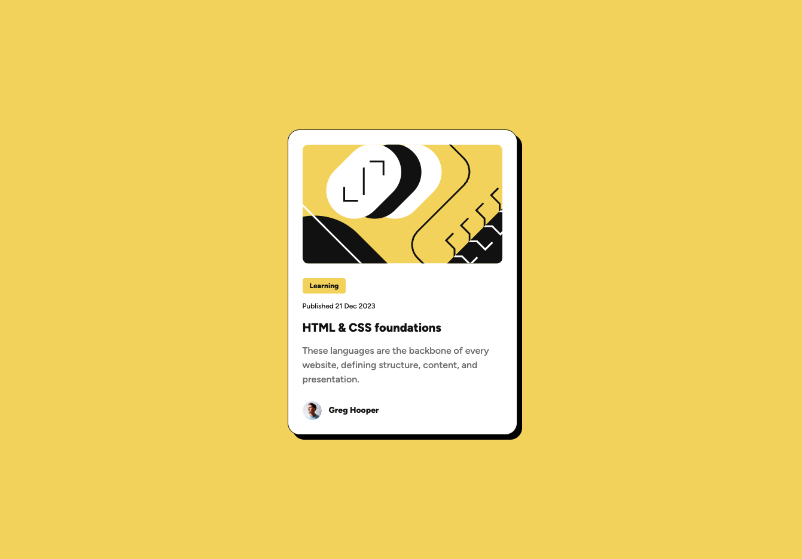

# Blog preview card solution

This is a solution to the [Blog preview card challenge on Frontend Mentor](https://www.frontendmentor.io/challenges/blog-preview-card-ckPaj01IcS).

## Table of contents

- [Overview](#overview)
  - [The challenge](#the-challenge)
  - [Screenshot](#screenshot)
  - [Links](#links)
- [My process](#my-process)
  - [Built with](#built-with)
  - [What I learned](#what-i-learned)
  - [Continued development](#continued-development)
  - [Useful resources](#useful-resources)
- [Author](#author)

## Overview

### The challenge

Users should be able to:

- See hover and focus states for all interactive elements on the page
- Change font size without using media queries

### Screenshot

### Links

- [Solution on frontendmentor.io]()
- [Live preview]()

## My process

### Built with

- Semantic HTML5 markup
- CSS custom properties
- Flexbox
- CSS Grid
- Mobile-first workflow
- BEM methodology

### What I learned

This project was very fun to build. Quiet easy, but I love the usage of colors and this yellow is just stunning. I already knew `clamp()` function but working on this project showed me different usage of it `clamp(1.4rem, 1.2rem + 0.5vw, 1.6rem)` which helps to change font size based on window width.

### Continued development

In the future I definitely want to more simple projects because they help me organize my knowledge and I find a new things everytime I move back to basics. Never ending journey, but that what is fun in being a developer.

### Useful resources

- [MDN - clamp()](https://developer.mozilla.org/en-US/docs/Web/CSS/clamp) - This function helped me with changing font size without using media queries.
- [Dynamic viewport height](https://dev.to/frehner/css-vh-dvh-lvh-svh-and-vw-units-27k4) - Great article about dynamic viewport height for removing scroll on mobile device.

## Author

- Github - [@PiwkoO](https://github.com/PiwkoO)
- Frontend Mentor - [@PiwkoO](https://www.frontendmentor.io/profile/PiwkoO)